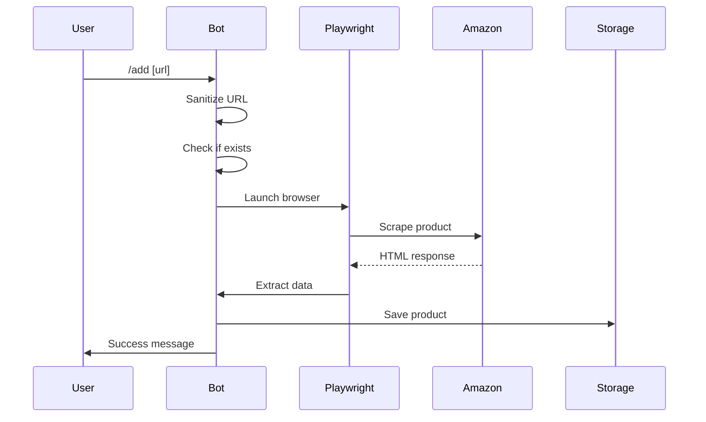
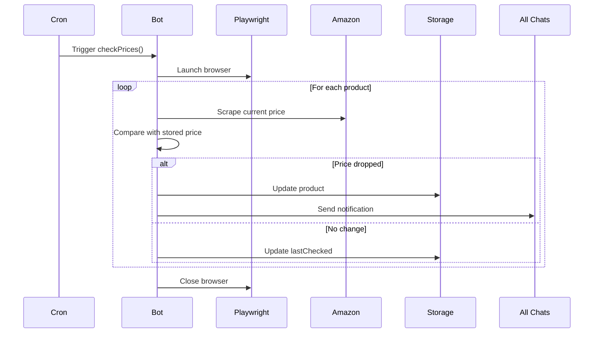

## Overview

The Price Tracker Bot is built as a single-threaded Node.js application that combines multiple components:

- **Telegram Bot Interface** (node-telegram-bot-api)
- **Web Scraper** (Playwright with Chromium)
- **Scheduled Tasks** (node-cron)
- **File-based Persistence** (JSON storage)
- **Chart Generation** (Chart.js + Playwright)

## Core Components

### 1. Bot Initialization

The bot initializes using the Telegram Bot API with long polling:

```javascript
const TELEGRAM_TOKEN = process.env.TELEGRAM_TOKEN;
const bot = new TelegramBot(TELEGRAM_TOKEN, { polling: true });
```

**Location**: `index.mjs:11-17`

<Note>
The bot uses environment variables for configuration. If `TELEGRAM_TOKEN` is missing, the process exits with an error.
</Note>

### 2. Event Handlers

The bot registers several event handlers for user commands:

| Command | Handler Location | Description |
|---------|-----------------|-------------|
| `/start` | `index.mjs:359-381` | Welcome message and chat registration |
| `/add [url]` | `index.mjs:398-467` | Add product to tracking |
| `/check` | `index.mjs:470-486` | Force immediate price check |
| `/list` | `index.mjs:489` | Display tracked products |
| `/remove [url]` | `index.mjs:520-542` | Remove product from tracking |
| `/edit [old] [new]` | `index.mjs:545-610` | Update product URL |
| `/chart [url]` | `index.mjs:613-623` | Generate price history chart |
| `/stats` | `index.mjs:492-517` | Display tracking statistics |

#### Callback Query Handler

Inline keyboard buttons trigger callback queries processed at `index.mjs:626-702`:

```javascript
bot.on("callback_query", async (callbackQuery) => {
  const data = callbackQuery.data;
  const msg = callbackQuery.message;
  const chatId = msg.chat.id;
  
  // Handle actions:
  // - select_product:<url>
  // - delete_product:<url>
  // - edit_product:<url>
  // - delete_all
  // - list
  // - check_prices
  // - chart:<url>
});
```

### 3. Cron Jobs

Two scheduled tasks run automatically:

#### Daily Summary (20:00)

```javascript
cron.schedule("0 20 * * *", async () => {
  console.log("📄 Envío de resumen diario...");
  for (const chatId of chats) {
    await dailySummary(chatId);
    await new Promise(r => setTimeout(r, 400));
  }
});
```

**Location**: `index.mjs:720-730`

#### Automatic Price Checks (Every 2 hours)

```javascript
cron.schedule("0 */2 * * *", async () => {
  console.log("🔄 Cron: revisión automática de precios...");
  await checkPrices();
});
```

**Location**: `index.mjs:733-740`

<Info>
Cron expressions use server timezone. Adjust according to deployment environment.
</Info>

### 4. Persistence Layer

Data is stored in a single JSON file (`prices.json`):

```javascript
const DATA_FILE = "prices.json";
let priceData = {}; // Keyed by sanitized URL
let chats = new Set(); // Active chat IDs

function loadData() {
  if (fs.existsSync(DATA_FILE)) {
    const saved = JSON.parse(fs.readFileSync(DATA_FILE, "utf8"));
    priceData = saved.products || {};
    chats = new Set(saved.chats || []);
  }
}

function saveData() {
  fs.writeFileSync(DATA_FILE, JSON.stringify({
    products: priceData,
    chats: [...chats]
  }, null, 2));
}
```

**Location**: `index.mjs:20-50`

<Note>
Data is loaded on startup (`index.mjs:50`) and saved after every mutation.
</Note>

### 5. Web Scraper

The scraper uses Playwright with Chromium in headless mode:

```javascript
async function scrapeProduct(page, url) {
  await page.goto(url, { waitUntil: "domcontentloaded", timeout: 60000 });
  await page.waitForTimeout(800);
  
  // Extract title, price, image using multiple selectors
  const title = await page.evaluate(() => { /* ... */ });
  const priceText = await page.evaluate(() => { /* ... */ });
  const imageUrl = await page.evaluate(() => { /* ... */ });
  
  return { url, title, price, imageUrl };
}
```

**Location**: `index.mjs:73-136`

See [Web Scraping](/technical/web-scraping) for detailed implementation.

### 6. Chart Generator

Charts are generated using Chart.js rendered in a headless browser:

```javascript
async function generateChartBuffer(labels, prices, title) {
  const browser = await chromium.launch({ headless: true });
  const page = await browser.newPage();
  
  // Inject HTML with Chart.js from CDN
  await page.setContent(html, { waitUntil: "load" });
  await page.waitForTimeout(1000);
  
  const canvas = await page.$("#chart");
  const buffer = await canvas.screenshot();
  await browser.close();
  
  return buffer;
}
```

**Location**: `index.mjs:253-307`

<Tip>
The chart is rendered as a PNG buffer and sent directly to Telegram using `bot.sendPhoto()`.
</Tip>

## Data Flow

### Adding a Product



**Flow steps**:
1. User sends `/add [url]`
2. URL is sanitized using `sanitizeAmazonURL()` (`index.mjs:53-61`)
3. Check if product already tracked
4. Launch temporary browser instance
5. Scrape product using `scrapeProduct()` (`index.mjs:73-136`)
6. Create product object with initial history entry
7. Save to `priceData` and persist to disk
8. Send confirmation to user

### Price Check Cycle



**Flow steps** (`index.mjs:139-250`):
1. Launch single browser instance (reused for all products)
2. Iterate through all tracked products
3. Scrape current price for each product
4. Compare `scraped.price` with `stored.price`
5. If price dropped:
   - Calculate savings and percentage
   - Build notification message
   - Send to all registered chats
6. Update product data:
   - Append to `history` array
   - Update `lowestPrice` if applicable
   - Update `lastChecked` timestamp
7. Save data to disk
8. Close browser

<Info>
The bot processes products sequentially with 900ms delays to avoid rate limiting (`index.mjs:214`).
</Info>

## Error Handling

### Scraping Errors

When scraping fails, the function returns an error object:

```javascript
if (scraped.error) {
  errors.push(`Error en ${stored.title || key}: ${scraped.error}`);
  stored.lastChecked = new Date().toISOString();
  priceData[key] = stored;
  continue;
}
```

**Location**: `index.mjs:165-172`

### Bot Errors

Global error handlers prevent crashes:

```javascript
bot.on("polling_error", (err) => 
  console.error("❌ Polling error:", err?.message || err)
);

bot.on("error", (err) => 
  console.error("❌ Bot error:", err?.message || err)
);
```

**Location**: `index.mjs:715-716`

### Graceful Shutdown

```javascript
process.on("SIGINT", async () => {
  console.log("🛑 Cerrando bot...");
  bot.stopPolling();
  process.exit(0);
});
```

**Location**: `index.mjs:743-750`

## Performance Considerations

### Browser Instance Management

<Accordion title="Single vs Multiple Browsers">
**During price checks**: A single browser instance is launched and reused for all products to reduce overhead.

```javascript
const browser = await chromium.launch({ 
  headless: true, 
  args: ["--no-sandbox", "--disable-dev-shm-usage"] 
});
const context = await browser.newContext();
const page = await context.newPage();

// Reuse 'page' for all products
for (const key of keys) {
  const scraped = await scrapeProduct(page, sanitized);
}

await browser.close();
```

**For user commands**: Temporary browsers are launched per request and closed immediately after.
</Accordion>

### Rate Limiting

Delays are inserted between operations:

- **Between products during checks**: 900ms (`index.mjs:214`)
- **Between notifications**: 500ms (`index.mjs:242`)
- **Between daily summaries**: 400ms (`index.mjs:725`)

### Memory Management

- **History limit**: Only the last 120 price points are kept per product (`index.mjs:69`)
- **Browser cleanup**: All browser instances are explicitly closed after use
- **Data persistence**: In-memory data is immediately synced to disk

## Utility Functions

### URL Sanitization

Removes query parameters and hash fragments:

```javascript
function sanitizeAmazonURL(url) {
  try {
    const u = new URL(url);
    return u.origin + u.pathname;
  } catch {
    return url.split("?")[0];
  }
}
```

**Location**: `index.mjs:53-61`

**Example**:
```
Input:  https://amazon.com/dp/B08N5WRWNW?tag=xyz&psc=1
Output: https://amazon.com/dp/B08N5WRWNW
```

### Markdown Escaping

Prevents Telegram markdown parsing errors:

```javascript
function escapeMD(text = "") {
  return String(text).replace(/([_*[\]()~`>#+\-=|{}.!])/g, "\\$1");
}
```

**Location**: `index.mjs:64-66`

<Note>
All user-facing text containing product titles or prices is escaped before sending to Telegram.
</Note>

## Configuration

### Environment Variables

- `TELEGRAM_TOKEN` (required): Bot token from BotFather

### Constants

```javascript
const DATA_FILE = "prices.json";      // Storage file
const HISTORY_LIMIT = 120;            // Max history entries
```

### Chromium Launch Arguments

```javascript
args: ["--no-sandbox", "--disable-dev-shm-usage"]
```

These flags are required for running in containerized environments.

## Deployment Considerations

<Accordion title="Production Checklist">
1. **Set `TELEGRAM_TOKEN` environment variable**
2. **Install Playwright browsers**: `npx playwright install chromium`
3. **Ensure write permissions** for `prices.json`
4. **Configure timezone** for cron jobs
5. **Monitor memory usage** (Chromium instances)
6. **Set up process manager** (PM2, systemd)
7. **Enable logging** (consider Winston or Pino)
8. **Implement backup strategy** for `prices.json`
</Accordion>

## Extension Points

### Adding New Commands

Register command handlers using regex patterns:

```javascript
bot.onText(/\/mycommand (.+)/, async (msg, match) => {
  const chatId = msg.chat.id;
  const arg = match[1];
  // Implementation
});
```

### Supporting Other E-commerce Sites

Modify `scrapeProduct()` to detect domain and use appropriate selectors:

```javascript
if (url.includes('ebay.com')) {
  // eBay-specific selectors
} else if (url.includes('amazon.com')) {
  // Amazon-specific selectors
}
```

### Alternative Storage Backends

Replace `loadData()` and `saveData()` with database operations:

```javascript
function loadData() {
  // Load from MongoDB/PostgreSQL/Redis
}

function saveData() {
  // Save to database
}
```